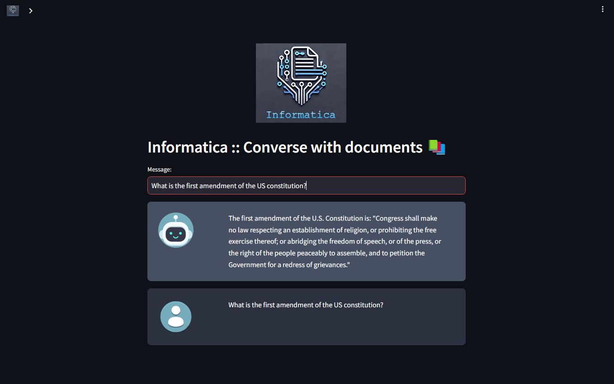

# Informatica

It's a "talk to your documents" kind of project that I built to help me search better into all kids of books and technical manuals I have, and also to learn how to set up an AI chatbot.

This project uses Ollama with Mistral 7B model for LLM, and nomic-embed-text model for embeddings.
I also added Weaviate db as memory, to permanently store the created embeddings.

## How it works
The frontend is Streamlit, a very convenient Python frontend library that helped me get up and running with the UI real quick.

I extract the text from the uploaded PDF files, split it into 1000 char chunks and create embeddings for them (with 100 chars overlap, in case the cut is in the middle of a word or something). This seemed like a sane default, I will probably experiment with different values in the future, to find an optimal spot.

After the embeddings are created, I add the file name as metadata to them, and store them in the vector database. The metadata is to map embeddings to documents, for example to remove all the document's data from the db.

Using Langchain I tell the Ollama LLM client to use Weaviate as vectorstore and I pass the user input to the LLM. Behind the scenes the user input is also transformed into an embedding, and weaviate does it's vector search magic to retrieve the relevant information for the LLM model. I don't have to worry about that at all.

## See it in action
The page is available [here](http://informatica.lucianmusat.nl/), but because it's self-hosted it might not always be up.

Be patient, it's running on a very small server, with an i5 and a tiny 4Gb low profile GPU, so it will be slow.

## TODO

 - [ ] Add authentication (I don't want my server to be spammed by randos or bots)
 - [ ] Add multi-tenancy (Each user will only see its own documents)
