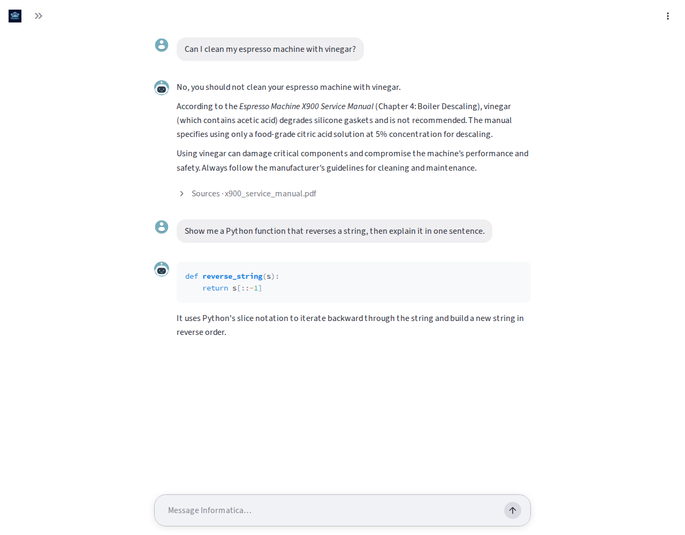

# Informatica



A self-hosted chat assistant running on my local k3s cluster. It started life as a
pure "talk to your PDFs" RAG toy; it's now a general-purpose chatbot that *also*
knows about the documents you've given it — ask it to write a shell script and it
just answers, ask it about your espresso machine manual and it pulls the manual.

Runs entirely on my own hardware: Ollama for inference, Weaviate for the vector
store, Streamlit for the UI.

## How it works

**Chat.** Every message goes to the model as a proper message list — system prompt,
prior turns, current question — in a single call. No condense/rephrase step, because
that extra round-trip both doubled latency and leaked "intermediary questions" into
the transcript.

**Retrieval is conditional.** This is the part that makes it feel like a chatbot
rather than a search box. Each message is embedded and matched against the library
with a `near_vector` query, which returns a genuine cosine distance. In **Auto** mode
a chunk is only shown to the model when it lands within `RETRIEVAL_MAX_DISTANCE`, so
an off-topic question contributes no context at all and gets a normal answer. The
sidebar can force **Always** or **Never** when the heuristic guesses wrong.

> A note for anyone reading the code: this deliberately does *not* use
> `WeaviateVectorStore.similarity_search_with_score()`. Despite its docstring
> promising cosine distance, that method runs a **hybrid** BM25+vector query and
> returns Weaviate's fused score, which is normalised *within each result set* — the
> top hit always scores near the top of the range regardless of whether it is
> relevant. It cannot be thresholded. `rag.retrieve()` queries the collection
> directly instead.

**Ingestion.** PDFs are extracted with PyMuPDF (pypdf as fallback), split
recursively at ~1000 chars with 200 overlap, embedded with `nomic-embed-text` and
stored in Weaviate with the file name as metadata so a document can be deleted again
as a unit.

## Model

Default is **`qwen3:4b-instruct`** — the non-thinking Instruct-2507 build at Q4_K_M.
Measured on a 4096-token context with `OLLAMA_FLASH_ATTENTION=1` and
`OLLAMA_KV_CACHE_TYPE=q8_0`:

| | VRAM |
|---|---|
| model weights | 2376 MiB |
| KV cache (q8_0, 4096 ctx) | 306 MiB |
| compute buffer | 79 MiB |
| **total** | **2760 MiB** |

With `nomic-embed-text` (~274 MiB) also resident that's ~3.0 GB, which fits the
cluster's 4 GB card with room to spare. Those two Ollama environment variables matter
— they're set on the **Ollama server**, not by this app, so they belong in the Ollama
deployment. Unquantised KV would add another ~306 MiB at this context size.

Drop `LLM_MODEL` back to `qwen2.5:3b-instruct` (1.9 GB weights) if the card turns out
to be tighter than expected. Mistral 7B, used in an earlier version, does not fit and
was slow.

## Running it locally

`docker-compose.yml` brings up the whole stack — Ollama with GPU, Weaviate, and the
app built from the same Dockerfile used in the cluster.

```bash
docker compose up -d ollama weaviate    # backends
docker compose run --rm model-init      # pull the models (once, ~2.8 GB)
docker compose up app                   # http://localhost:8501
```

GPU access needs the **native** Docker daemon. If `docker context ls` shows
`desktop-linux` as current, Docker Desktop's VM has no nvidia runtime — prefix the
commands with `docker --context default` or `export DOCKER_CONTEXT=default`. Remove
the `runtime: nvidia` line from the ollama service to fall back to CPU.

To run just the Streamlit app against backends already on localhost, use `./run.sh`.

### Tuning the retrieval threshold

`RETRIEVAL_MAX_DISTANCE` decides when Auto mode pulls in documents. To see where the
line should sit, `tools/calibrate_retrieval.py` indexes a sample manual and reports
the distances for a set of on-topic and off-topic questions:

```bash
docker compose exec app python tools/calibrate_retrieval.py
```

## Configuration

Everything lives in `config.py` and is environment-overridable:

| variable | default | meaning |
|---|---|---|
| `LLM_MODEL` | `qwen3:4b-instruct` | chat model |
| `EMBEDDER_MODEL` | `nomic-embed-text` | embedding model |
| `OLLAMA_URL` | cluster service DNS | Ollama endpoint |
| `OLLAMA_NUM_CTX` | `4096` | context window |
| `OLLAMA_TEMPERATURE` | `0.6` | sampling temperature |
| `WEAVIATE_URL` | cluster service DNS | Weaviate host |
| `RETRIEVAL_K` | `4` | chunks fetched per query |
| `RETRIEVAL_MAX_DISTANCE` | `0.50` | Auto-mode cosine distance cutoff |
| `MAX_HISTORY_MESSAGES` | `20` | turns replayed to the model |

## See it in action

The page is available [here](http://informatica.lucianmusat.nl/), but because it's
self-hosted it might not always be up. Be patient — small server, small GPU.

## TODO

 - [X] Display LLM answer while it's being generated
 - [X] Work as a general assistant, not only a document search box
 - [ ] Add authentication (I don't want my server to be spammed by randos or bots)
 - [ ] Add multi-tenancy (each user only sees their own documents)
 - [ ] Prefix embeddings with `search_query:` / `search_document:` as nomic-embed-text
       expects — needs a full re-index of existing documents, so it's a breaking change
 - [ ] Support more than PDFs (txt, markdown, epub)
